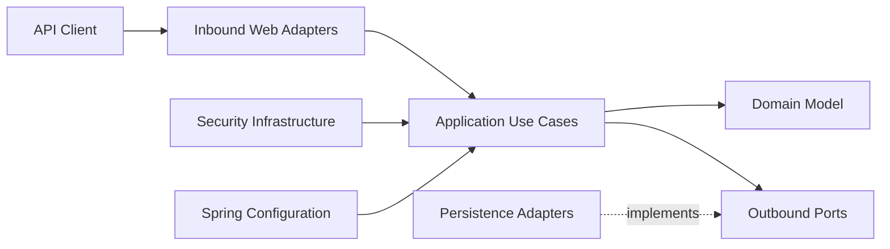

# SupportDesk

[](https://www.oracle.com/java/)
[](https://spring.io/projects/spring-boot)
[](https://www.postgresql.org/)
[](https://github.com/Seyidli06/supportdesk/releases/tag/v1.0.0)
[](https://github.com/Seyidli06/supportdesk/actions/workflows/ci.yml)
[](#architecture)

SupportDesk is a production-ready customer-support ticket REST API built with Java 21, Spring Boot, PostgreSQL, and Clean Architecture.

The application manages authentication, users, roles, tickets, assignments, comments, ticket status and priority changes, and complete ticket audit history.

## Current Release

Stable version:

```text
v1.0.0
```

Main production capabilities:

- JWT authentication and role-based authorization
- `USER`, `AGENT`, and `ADMIN` roles
- Ticket creation, filtering, pagination, assignment, and comments
- Controlled ticket status and priority changes
- Persistent ticket event and audit history
- Token-version-based stale JWT invalidation
- Optimistic locking and HTTP `409 Conflict` handling
- RFC 7807 Problem Details error responses
- Bucket4j request rate limiting
- PostgreSQL persistence and Flyway migrations
- Docker production deployment
- Actuator liveness and readiness probes
- GitHub Actions continuous integration
- Automated integration and production smoke tests

## Table of Contents

- [Features](#features)
- [Technology Stack](#technology-stack)
- [Architecture](#architecture)
- [Roles and Permissions](#roles-and-permissions)
- [Ticket Lifecycle](#ticket-lifecycle)
- [Ticket Audit History](#ticket-audit-history)
- [API Endpoints](#api-endpoints)
- [Getting Started with Docker](#getting-started-with-docker)
- [Local Development](#local-development)
- [Environment Variables](#environment-variables)
- [Health Checks](#health-checks)
- [API Documentation](#api-documentation)
- [Administrator Bootstrap](#administrator-bootstrap)
- [Testing](#testing)
- [Database Migrations](#database-migrations)
- [Production Notes](#production-notes)
- [Release](#release)

## Features

### Authentication and Security

- User registration and login
- Password hashing through Spring Security
- Stateless JWT authentication
- Configurable JWT expiration
- JWT token-version validation
- Automatic invalidation of old JWTs after role changes
- Role-based endpoint and business-rule authorization
- Public health-check endpoints
- Configurable request rate limiting
- Rate-limit buckets cached with Caffeine

### Ticket Management

- Create tickets
- Retrieve ticket details
- List visible tickets
- Filter tickets by status and priority
- Paginated ticket queries
- Assign tickets to agents
- Prevent unauthorized agent assignment takeover
- Add ticket comments
- Change ticket status
- Change ticket priority
- Enforce valid ticket lifecycle transitions
- Detect concurrent updates with optimistic locking

### Audit History

Ticket mutations generate persistent audit events for:

- Ticket creation
- Assignment changes
- Status changes
- Priority changes
- Added comments

Ticket state and its corresponding event are persisted atomically in the same transaction.

### Production Readiness

- Multi-stage Docker image
- Non-root runtime user
- PostgreSQL Docker service
- Persistent PostgreSQL volume
- Production Spring profile
- Graceful shutdown
- HikariCP production pool configuration
- Database-backed readiness check
- Kubernetes-compatible liveness and readiness probes
- Swagger and OpenAPI disabled by default in production
- Automated Maven verification
- Automated production Docker image build

## Technology Stack

| Technology | Purpose |
|---|---|
| Java 21 | Application language |
| Spring Boot 3.3.2 | Application framework |
| Spring Web MVC | REST API |
| Spring Security | Authentication and authorization |
| Spring Data JPA | Persistence |
| Hibernate | ORM and optimistic locking |
| PostgreSQL 16 | Relational database |
| Flyway | Versioned database migrations |
| JJWT 0.12.6 | JWT creation and validation |
| Bucket4j 8.18.0 | Request rate limiting |
| Caffeine 3.2.4 | Rate-limit bucket cache |
| Springdoc OpenAPI 2.6.0 | OpenAPI and Swagger UI |
| Spring Boot Actuator | Health and availability probes |
| Maven Wrapper | Build automation |
| JUnit 5 | Unit and integration testing |
| Docker | Containerized deployment |
| GitHub Actions | Continuous integration |

## Architecture

SupportDesk follows Clean Architecture and dependency-inversion principles.



### Domain Layer

The domain layer contains framework-independent business rules:

- Ticket aggregate
- Ticket comments
- Ticket statuses
- Ticket priorities
- Ticket events
- Value objects
- Status-transition rules
- Domain exceptions

The domain layer does not depend on Spring, JPA, controllers, or infrastructure components.

### Application Layer

The application layer contains use cases and orchestration logic:

- Authentication
- Ticket creation
- Ticket assignment
- Ticket comments
- Ticket status changes
- Ticket priority changes
- Ticket event queries
- Ticket listing and retrieval
- User and role administration
- Security context and authorization rules
- Outbound port interfaces

### Inbound Adapters

The inbound web adapters contain:

- REST controllers
- Request DTOs
- Response DTOs
- Request validation
- Global exception handling
- Problem Details responses

### Outbound Adapters

The outbound persistence adapters contain:

- JPA entities
- Spring Data repositories
- Persistence mappers
- Repository adapters
- Atomic ticket and event persistence

### Infrastructure Layer

The infrastructure layer contains:

- Spring bean configuration
- JWT authentication filter
- Password encoder
- Spring Security configuration
- Rate limiting
- Actuator and production configuration

## Roles and Permissions

The application supports three roles.

| Role | Main permissions |
|---|---|
| `USER` | Register, log in, create tickets, view permitted tickets, add comments, and view permitted ticket events |
| `AGENT` | View permitted tickets, self-assign eligible tickets, update assigned tickets, add comments, and view ticket events |
| `ADMIN` | Manage users and roles, view all tickets, assign tickets, update ticket status and priority, add comments, and view audit events |

### Assignment Rules

- Only an `AGENT` or `ADMIN` can assign a ticket.
- An agent can assign an eligible ticket only to themselves.
- An agent cannot take over a ticket assigned to another agent.
- An administrator can assign a ticket to a user with the `AGENT` role.
- A ticket cannot be assigned to a user without the `AGENT` role.

### Status Rules

- A `USER` cannot change ticket status.
- An `AGENT` can change the status only of a ticket assigned to them.
- An `ADMIN` can change the status of any ticket.
- Invalid status transitions are rejected.

### Priority Rules

- A `USER` cannot change ticket priority.
- An `AGENT` can change priority only for a ticket assigned to them.
- An `ADMIN` can change priority for any ticket.

### User Administration Rules

All `/api/v1/users/**` endpoints require the `ADMIN` role.

When an administrator changes a user's roles, the user's token version is incremented. Previously issued JWTs for that user become invalid.

An administrator cannot remove their own final administrator access through the role-management API.

## Ticket Lifecycle

Available statuses:

- `OPEN`
- `IN_PROGRESS`
- `WAITING_CUSTOMER`
- `RESOLVED`
- `CLOSED`

Valid transitions:

```text
OPEN
└── IN_PROGRESS
    ├── WAITING_CUSTOMER
    │   ├── IN_PROGRESS
    │   └── RESOLVED
    └── RESOLVED
        ├── IN_PROGRESS
        └── CLOSED
```

`CLOSED` is a terminal status.

Available priorities:

- `LOW`
- `MEDIUM`
- `HIGH`
- `URGENT`

## Ticket Audit History

Every meaningful ticket mutation creates a `ticket_events` record.

Supported event types:

| Event type | Meaning |
|---|---|
| `TICKET_CREATED` | A new ticket was created |
| `ASSIGNMENT_CHANGED` | The assigned agent changed |
| `STATUS_CHANGED` | The ticket status changed |
| `PRIORITY_CHANGED` | The ticket priority changed |
| `COMMENT_ADDED` | A comment was added |

Event history can be retrieved through:

```text
GET /api/v1/tickets/{ticketId}/events
```

Each event can contain:

- Event ID
- Ticket ID
- Actor ID
- Event type
- Previous value
- New value
- Creation timestamp

Ticket mutation and audit-event persistence are executed atomically. If event persistence fails, the ticket mutation is rolled back.

## API Endpoints

The API prefix is:

```text
/api/v1
```

### Authentication

| Method | Endpoint | Access | Description |
|---|---|---|---|
| `POST` | `/api/v1/auth/register` | Public | Register a user |
| `POST` | `/api/v1/auth/login` | Public | Authenticate and receive a JWT |

### Tickets

| Method | Endpoint | Access | Description |
|---|---|---|---|
| `POST` | `/api/v1/tickets` | Authenticated | Create a ticket |
| `GET` | `/api/v1/tickets` | Authenticated | List visible tickets |
| `GET` | `/api/v1/tickets/{ticketId}` | Authenticated with access | Get ticket details |
| `PATCH` | `/api/v1/tickets/{ticketId}/assignment` | Agent or Admin | Assign a ticket |
| `POST` | `/api/v1/tickets/{ticketId}/comments` | Authenticated with access | Add a comment |
| `PATCH` | `/api/v1/tickets/{ticketId}/status` | Assigned Agent or Admin | Change status |
| `PATCH` | `/api/v1/tickets/{ticketId}/priority` | Assigned Agent or Admin | Change priority |
| `GET` | `/api/v1/tickets/{ticketId}/events` | Authenticated with access | Get ticket event history |

Ticket-list query parameters:

| Parameter | Required | Default |
|---|---:|---|
| `status` | No | All visible statuses |
| `priority` | No | All visible priorities |
| `page` | No | `0` |
| `size` | No | `20` |

Example:

```text
GET /api/v1/tickets?status=OPEN&priority=HIGH&page=0&size=20
```

### User Administration

| Method | Endpoint | Access | Description |
|---|---|---|---|
| `GET` | `/api/v1/users` | Admin | List and filter users |
| `GET` | `/api/v1/users/{userId}` | Admin | Get user details |
| `PATCH` | `/api/v1/users/{userId}/roles` | Admin | Replace user roles |

User-list query parameters:

| Parameter | Required | Default |
|---|---:|---|
| `role` | No | All roles |
| `email` | No | All emails |
| `page` | No | `0` |
| `size` | No | `20` |

## Getting Started with Docker

### Prerequisites

Install:

- Docker Desktop
- Git
- PowerShell or Windows Terminal

### Clone the Repository

```powershell
git clone https://github.com/Seyidli06/supportdesk.git

Set-Location ".\supportdesk"
```

### Create the Environment File

Generate a secure JWT secret:

```powershell
$secretBytes = New-Object byte[] 64

[System.Security.Cryptography.RandomNumberGenerator]::Fill(
    $secretBytes
)

$jwtSecret = [Convert]::ToBase64String(
    $secretBytes
)
```

Create `.env`:

```powershell
@"
POSTGRES_DB=supportdesk_db
POSTGRES_USER=postgres
POSTGRES_PASSWORD=change_me
POSTGRES_PORT=5433

APP_PORT=8081

JWT_SECRET=$jwtSecret
JWT_EXPIRATION_SECONDS=3600

RATE_LIMIT_ENABLED=true

OPENAPI_ENABLED=false
SWAGGER_UI_ENABLED=false
"@ | Set-Content `
    -LiteralPath ".\.env" `
    -Encoding UTF8
```

The `.env` file contains secrets and must not be committed.

### Start the Full Stack

```powershell
docker compose up -d --build
```

Check container state:

```powershell
docker compose ps
```

Expected containers:

```text
supportdesk-api
supportdesk-db
```

The API is available at:

```text
http://localhost:8081
```

PostgreSQL is exposed at:

```text
localhost:5433
```

### Stop the Stack

```powershell
docker compose down
```

Stop the stack and remove its database volume:

```powershell
docker compose down -v
```

The second command permanently deletes local database data.

## Local Development

### Prerequisites

Install:

- Java 21
- Docker Desktop
- Git
- PowerShell or Windows Terminal

The Maven Wrapper is included. A separate Maven installation is not required.

### Start Only PostgreSQL

Create a `.env` containing at least:

```dotenv
POSTGRES_DB=supportdesk_db
POSTGRES_USER=postgres
POSTGRES_PASSWORD=change_me
POSTGRES_PORT=5433
```

Start PostgreSQL:

```powershell
docker compose up -d postgres
```

### Configure the Application

Generate and set a development JWT secret:

```powershell
$secretBytes = New-Object byte[] 64

[System.Security.Cryptography.RandomNumberGenerator]::Fill(
    $secretBytes
)

$env:JWT_SECRET = [Convert]::ToBase64String(
    $secretBytes
)
```

Set the remaining variables:

```powershell
$env:DB_URL = "jdbc:postgresql://localhost:5433/supportdesk_db"
$env:DB_USERNAME = "postgres"
$env:DB_PASSWORD = "change_me"

$env:SERVER_PORT = "8081"
$env:JWT_EXPIRATION_SECONDS = "3600"

$env:RATE_LIMIT_ENABLED = "false"
```

Run the application:

```powershell
cmd.exe /d /c ".\mvnw.cmd spring-boot:run"
```

## Environment Variables

### Core Application Variables

| Variable | Required | Default | Description |
|---|---:|---|---|
| `APP_NAME` | No | `supportdesk` | Spring application name |
| `DB_URL` | Yes outside Compose app config | — | PostgreSQL JDBC URL |
| `DB_USERNAME` | Yes | — | Database username |
| `DB_PASSWORD` | Yes | — | Database password |
| `SERVER_PORT` | No | `8080` | Internal HTTP port |
| `JWT_SECRET` | Yes | — | Base64-encoded signing secret |
| `JWT_EXPIRATION_SECONDS` | No | `3600` | JWT lifetime |
| `FLYWAY_ENABLED` | No | `true` | Enable database migrations |
| `JPA_SHOW_SQL` | No | `true` | Log SQL in development |
| `JPA_FORMAT_SQL` | No | `true` | Format SQL logs |
| `RATE_LIMIT_ENABLED` | No | `true` | Enable rate limiting |

### Docker Compose Variables

| Variable | Default | Description |
|---|---|---|
| `POSTGRES_DB` | `supportdesk_db` | PostgreSQL database |
| `POSTGRES_USER` | `postgres` | PostgreSQL user |
| `POSTGRES_PASSWORD` | Required | PostgreSQL password |
| `POSTGRES_PORT` | `5433` | Host PostgreSQL port |
| `APP_PORT` | `8081` | Host API port |
| `OPENAPI_ENABLED` | `false` | Enable OpenAPI in production |
| `SWAGGER_UI_ENABLED` | `false` | Enable Swagger UI in production |

### Production Database Pool Variables

| Variable | Default |
|---|---:|
| `DB_POOL_MAX_SIZE` | `10` |
| `DB_POOL_MIN_IDLE` | `2` |
| `DB_CONNECTION_TIMEOUT_MS` | `30000` |
| `DB_VALIDATION_TIMEOUT_MS` | `5000` |
| `DB_MAX_LIFETIME_MS` | `1800000` |

### Default Rate-Limit Policies

| Policy | Capacity | Refill |
|---|---:|---|
| Login | `5` | 5 tokens per minute |
| Registration | `3` | 3 tokens per 10 minutes |
| Authenticated read | `120` | 120 tokens per minute |
| Authenticated write | `30` | 30 tokens per minute |
| Admin endpoints | `60` | 60 tokens per minute |
| Anonymous API requests | `60` | 60 tokens per minute |

The policy values can be overridden through the `RATE_LIMIT_*` environment variables defined in `application.yaml`.

## Health Checks

The application exposes Spring Boot Actuator health endpoints.

General health:

```text
GET /actuator/health
```

Liveness:

```text
GET /actuator/health/liveness
```

Readiness:

```text
GET /actuator/health/readiness
```

Docker uses the readiness endpoint for the application health check.

Example:

```powershell
Invoke-RestMethod `
    -Method Get `
    -Uri "http://localhost:8081/actuator/health/readiness"
```

Expected response:

```json
{
  "status": "UP"
}
```

The readiness group includes application readiness state and database connectivity.

## API Documentation

In local development, Swagger UI is available at:

```text
http://localhost:8081/swagger-ui/index.html
```

OpenAPI JSON:

```text
http://localhost:8081/v3/api-docs
```

OpenAPI and Swagger UI are disabled by default under the production profile.

To enable them in Docker:

```dotenv
OPENAPI_ENABLED=true
SWAGGER_UI_ENABLED=true
```

Restart the application after changing the values:

```powershell
docker compose up -d --build app
```

## Administrator Bootstrap

Newly registered users receive the `USER` role.

Register the initial administrator account:

```powershell
$adminResponse = Invoke-RestMethod `
    -Method Post `
    -Uri "http://localhost:8081/api/v1/auth/register" `
    -ContentType "application/json" `
    -Body (@{
        email = "admin@supportdesk.local"
        password = "Password123!"
        fullName = "SupportDesk Admin"
    } | ConvertTo-Json)

$adminId = [string]$adminResponse.userId
```

Assign the first `ADMIN` role directly in the local database:

```powershell
$sql = @"
DELETE FROM user_roles
WHERE user_id = '$adminId';

INSERT INTO user_roles (
    user_id,
    role
)
VALUES (
    '$adminId',
    'ADMIN'
);
"@

docker exec `
    supportdesk-db `
    psql `
    -U postgres `
    -d supportdesk_db `
    -v ON_ERROR_STOP=1 `
    -c $sql
```

Log in again after the role update:

```powershell
$adminLogin = Invoke-RestMethod `
    -Method Post `
    -Uri "http://localhost:8081/api/v1/auth/login" `
    -ContentType "application/json" `
    -Body (@{
        email = "admin@supportdesk.local"
        password = "Password123!"
    } | ConvertTo-Json)
```

The newly issued JWT contains the updated `ADMIN` role. JWTs issued before the role change are invalidated.

Direct database changes are intended only for the initial local administrator bootstrap. Production environments should use a controlled provisioning process.

## Request Examples

### Register

```json
{
  "email": "user@example.com",
  "password": "Password123!",
  "fullName": "Example User"
}
```

### Login

```json
{
  "email": "user@example.com",
  "password": "Password123!"
}
```

### Create a Ticket

```json
{
  "title": "Cannot access my account",
  "description": "The login page rejects my correct credentials.",
  "priority": "HIGH"
}
```

### Assign a Ticket

```json
{
  "agentId": "agent-user-id"
}
```

### Change Status

```json
{
  "status": "IN_PROGRESS"
}
```

### Change Priority

```json
{
  "priority": "URGENT"
}
```

### Add Comment

```json
{
  "content": "The issue is currently being investigated."
}
```

Authenticated requests require:

```http
Authorization: Bearer <access-token>
```

## Error Handling

API errors use Problem Details-compatible JSON responses.

Common status codes:

| Status | Meaning |
|---:|---|
| `400` | Invalid request or domain rule violation |
| `401` | Missing, invalid, expired, or stale JWT |
| `403` | Authenticated user lacks permission |
| `404` | Requested resource was not found |
| `409` | Concurrent modification or persistence conflict |
| `429` | Rate limit exceeded |
| `500` | Unexpected server error |

Optimistic-locking conflicts are returned as HTTP `409 Conflict` rather than generic server errors.

## Testing

### Full Test Suite

Run all unit and integration tests:

```powershell
cmd.exe /d /c ".\mvnw.cmd clean verify"
```

### Production Smoke Test

Start the full Docker stack:

```powershell
docker compose up -d --build
```

Run the PowerShell smoke test:

```powershell
powershell.exe `
    -NoProfile `
    -ExecutionPolicy Bypass `
    -File ".\smoke-test.ps1"
```

The smoke test verifies:

- Application readiness
- User registration and authentication
- Ticket creation and retrieval
- Ticket filtering and visibility
- User and agent comments
- Authorization restrictions
- Initial administrator bootstrap
- Role management
- Stale-token behavior after role changes
- Agent assignment
- Ticket status changes
- Ticket priority changes
- Ticket event history
- Final persisted ticket state

Successful completion prints:

```text
ALL SUPPORTDESK SMOKE TESTS PASSED
```

## Continuous Integration

The GitHub Actions workflow runs on:

- Pushes to `main`
- Pull requests targeting `main`
- Manual workflow dispatch

The CI job performs:

1. Repository checkout
2. Java 21 setup
3. PostgreSQL 16 service startup
4. Full Maven `clean verify`
5. Production Docker image build

Workflow file:

```text
.github/workflows/ci.yml
```

## Database Migrations

Flyway migrations are stored under:

```text
src/main/resources/db/migration
```

Current migrations:

| Migration | Purpose |
|---|---|
| `V1__init_schema.sql` | Initial users, roles, tickets, and comments schema |
| `V2__harden_constraints_and_indexes.sql` | Database constraints and indexes |
| `V3__add_user_token_version.sql` | JWT token-version support |
| `V4__add_ticket_event_history.sql` | Persistent ticket audit history |

Applied migrations must never be edited. New schema changes must be added as new versioned migration files.

## Production Notes

The production profile provides:

- Disabled Spring banner
- HikariCP pool configuration
- SQL logging disabled
- UTC JVM and Hibernate time zone
- Graceful application shutdown
- Forwarded-header support
- Restricted Actuator exposure
- Hidden health details
- Liveness and readiness probes
- OpenAPI disabled by default
- Swagger UI disabled by default

The runtime Docker image:

- Uses Java 21 JRE
- Runs as a non-root `supportdesk` user
- Exposes internal port `8080`
- Uses a readiness health check
- Supports graceful container shutdown

Do not commit:

- `.env`
- Production database passwords
- JWT secrets
- Access tokens
- Generated credentials

## Release

Current stable tag:

```text
v1.0.0
```

Check out the release:

```powershell
git fetch --tags

git checkout "v1.0.0"
```

Return to the main branch:

```powershell
git checkout main

git pull --ff-only origin main
```

Release tag:

```text
https://github.com/Seyidli06/supportdesk/releases/tag/v1.0.0
```