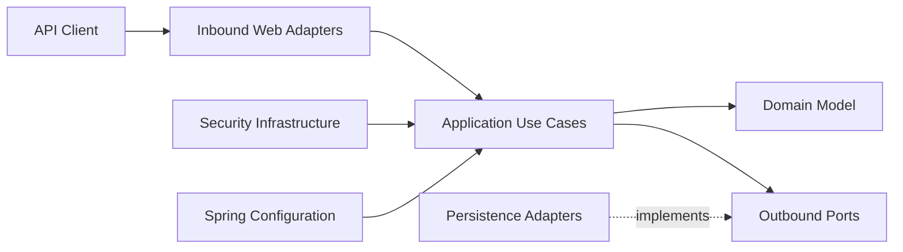

# SupportDesk


SupportDesk is a secure REST API for managing customer-support tickets, users, roles, assignments, comments, and ticket lifecycles.

The project is built with Java 21 and Spring Boot using Clean Architecture principles. It includes JWT authentication, role-based authorization, PostgreSQL persistence, Flyway migrations, OpenAPI documentation, request rate limiting, and automated tests.

## Table of Contents

- [Features](#features)
- [Technology Stack](#technology-stack)
- [Architecture](#architecture)
- [Project Structure](#project-structure)
- [Roles and Permissions](#roles-and-permissions)
- [Ticket Lifecycle](#ticket-lifecycle)
- [API Endpoints](#api-endpoints)
- [Getting Started](#getting-started)
- [Environment Variables](#environment-variables)
- [Administrator Bootstrap](#administrator-bootstrap)
- [Request Examples](#request-examples)
- [Rate Limiting](#rate-limiting)
- [Error Responses](#error-responses)
- [Testing](#testing)
- [Smoke Tests](#smoke-tests)
- [Database Model](#database-model)
- [Production Considerations](#production-considerations)

## Features

- User registration and login
- Stateless JWT authentication
- Role-based authorization
- User, agent, and administrator roles
- Ticket creation and retrieval
- Ticket filtering and pagination
- Ticket assignment to agents
- Ticket status management
- Ticket comments
- Administrative user management
- PostgreSQL persistence
- Flyway database migrations
- Optimistic locking for ticket updates
- Problem Details error responses
- Bucket4j request rate limiting
- Caffeine-backed in-memory bucket cache
- OpenAPI documentation and Swagger UI
- Unit and integration tests
- PowerShell smoke tests

## Technology Stack

| Technology | Purpose |
|---|---|
| Java 21 | Application language |
| Spring Boot 3.3.2 | Application framework |
| Spring Web MVC | REST API |
| Spring Security | Authentication and authorization |
| Spring Data JPA | Persistence |
| PostgreSQL | Relational database |
| Flyway | Database migrations |
| JJWT 0.12.6 | JWT creation and validation |
| Bucket4j 8.18.0 | Request rate limiting |
| Caffeine 3.2.4 | In-memory rate-limit bucket cache |
| Springdoc OpenAPI 2.6.0 | Swagger UI and OpenAPI documentation |
| Maven Wrapper | Build automation |
| JUnit 5 | Automated testing |
| Docker | Local PostgreSQL environment |

## Architecture

The project follows Clean Architecture and dependency-inversion principles.



### Domain Layer

The `domain` layer contains the core business model and business rules.

It includes:

- Ticket aggregate
- Ticket comments
- Ticket statuses
- Ticket priorities
- Value objects
- Ticket-status transition policy
- Domain exceptions

The domain layer does not depend on Spring, JPA, controllers, or infrastructure classes.

### Application Layer

The `application` layer contains use cases and orchestration logic.

It includes:

- Authentication
- Ticket creation
- Ticket assignment
- Ticket comments
- Ticket status changes
- Ticket queries
- User administration
- Application security context
- Outbound port interfaces

### Inbound Adapters

The `adapter.in` layer exposes application use cases to external clients.

It includes:

- REST controllers
- Request DTOs
- Response DTOs
- Global exception handling

### Outbound Adapters

The `adapter.out` layer implements outbound application ports.

It includes:

- JPA entities
- Spring Data repositories
- Persistence mappers
- Repository adapters

### Infrastructure Layer

The `infrastructure` layer contains framework-specific and technical components.

It includes:

- Spring bean configuration
- JWT authentication
- Password hashing
- Spring Security configuration
- Rate limiting

## Project Structure

```text
src
├── main
│   ├── java/com/adil/supportdesk
│   │   ├── adapter
│   │   │   ├── in/web
│   │   │   │   ├── auth
│   │   │   │   │   └── dto
│   │   │   │   ├── error
│   │   │   │   ├── ticket
│   │   │   │   │   └── dto
│   │   │   │   └── user
│   │   │   │       └── dto
│   │   │   └── out/persistence
│   │   │       ├── ticket
│   │   │       └── user
│   │   ├── application
│   │   │   ├── auth
│   │   │   ├── port/out
│   │   │   ├── security
│   │   │   ├── ticket
│   │   │   │   ├── assign
│   │   │   │   ├── changestatus
│   │   │   │   ├── comment
│   │   │   │   ├── create
│   │   │   │   ├── get
│   │   │   │   └── query
│   │   │   └── user/management
│   │   ├── domain
│   │   │   ├── ticket
│   │   │   └── user
│   │   ├── infrastructure
│   │   │   ├── config
│   │   │   ├── ratelimit
│   │   │   └── security
│   │   └── SupportDeskApplication.java
│   └── resources
│       ├── application.yaml
│       └── db/migration
└── test
    ├── java/com/adil/supportdesk
    └── resources
```

## Roles and Permissions

The application supports three roles:

| Role | Permissions |
|---|---|
| `USER` | Register, log in, create tickets, view permitted tickets, and add comments |
| `AGENT` | View permitted tickets, assign tickets to themselves, add comments, and update assigned-ticket statuses |
| `ADMIN` | Manage users and roles, assign tickets, view tickets, add comments, and update ticket statuses |

### Assignment Rules

- Only an `AGENT` or `ADMIN` can assign a ticket.
- An agent can assign a ticket only to themselves.
- An administrator can assign a ticket to any user with the `AGENT` role.
- A ticket cannot be assigned to a user who does not have the `AGENT` role.

### Status Management Rules

- A `USER` cannot change ticket status.
- An `AGENT` can change the status only of tickets assigned to them.
- An `ADMIN` can change the status of any ticket.

### User Administration Rules

All `/api/v1/users/**` endpoints require the `ADMIN` role.

An administrator cannot remove their own final administrator access through the role-management API.

## Ticket Lifecycle

Available statuses:

- `OPEN`
- `IN_PROGRESS`
- `WAITING_CUSTOMER`
- `RESOLVED`
- `CLOSED`

Valid transitions:

```text
OPEN
└── IN_PROGRESS
    ├── WAITING_CUSTOMER
    │   ├── IN_PROGRESS
    │   └── RESOLVED
    └── RESOLVED
        ├── IN_PROGRESS
        └── CLOSED
```

`CLOSED` is a terminal state.

Available priorities:

- `LOW`
- `MEDIUM`
- `HIGH`
- `URGENT`

## API Endpoints

The default API prefix is:

```text
/api/v1
```

### Authentication

| Method | Endpoint | Access | Description |
|---|---|---|---|
| `POST` | `/api/v1/auth/register` | Public | Register a new user |
| `POST` | `/api/v1/auth/login` | Public | Authenticate and receive a JWT |

### Tickets

| Method | Endpoint | Access | Description |
|---|---|---|---|
| `POST` | `/api/v1/tickets` | Authenticated | Create a ticket |
| `GET` | `/api/v1/tickets` | Authenticated | List visible tickets |
| `GET` | `/api/v1/tickets/{ticketId}` | Authenticated | Get ticket details |
| `PATCH` | `/api/v1/tickets/{ticketId}/assignment` | Agent or Admin | Assign a ticket |
| `POST` | `/api/v1/tickets/{ticketId}/comments` | Authenticated | Add a comment |
| `PATCH` | `/api/v1/tickets/{ticketId}/status` | Assigned Agent or Admin | Change ticket status |

Ticket-list query parameters:

| Parameter | Required | Default |
|---|---|---|
| `status` | No | All statuses |
| `priority` | No | All priorities |
| `page` | No | `0` |
| `size` | No | `20` |

### User Administration

| Method | Endpoint | Access | Description |
|---|---|---|---|
| `GET` | `/api/v1/users` | Admin | List and filter users |
| `GET` | `/api/v1/users/{userId}` | Admin | Get user details |
| `PATCH` | `/api/v1/users/{userId}/roles` | Admin | Replace user roles |

User-list query parameters:

| Parameter | Required | Default |
|---|---|---|
| `role` | No | All roles |
| `email` | No | All emails |
| `page` | No | `0` |
| `size` | No | `20` |

## Getting Started

### Prerequisites

Install:

- Java 21
- Docker Desktop
- Git
- PowerShell or Windows Terminal

The Maven Wrapper is included, so a separate Maven installation is not required.

### Clone the Repository

```powershell
git clone https://github.com/Seyidli06/supportdesk.git
cd supportdesk
```

### Start PostgreSQL

Create the development database container:

```powershell
docker run `
    --name supportdesk-db `
    --env POSTGRES_DB=supportdesk_db `
    --env POSTGRES_USER=postgres `
    --env POSTGRES_PASSWORD=12345 `
    --publish 5433:5432 `
    --detach `
    postgres:16-alpine
```

Start an existing stopped container:

```powershell
docker start supportdesk-db
```

### Configure the Environment

Generate a development JWT secret:

```powershell
$secretBytes = New-Object byte[] 64

[System.Security.Cryptography.RandomNumberGenerator]::Fill(
    $secretBytes
)

$env:JWT_SECRET = [Convert]::ToBase64String(
    $secretBytes
)
```

Set the remaining environment variables in the same terminal:

```powershell
$env:DB_URL = "jdbc:postgresql://localhost:5433/supportdesk_db"
$env:DB_USERNAME = "postgres"
$env:DB_PASSWORD = "12345"
$env:SERVER_PORT = "8081"
$env:JWT_EXPIRATION_SECONDS = "3600"
```

### Run the Application

```powershell
.\mvnw.cmd spring-boot:run
```

The examples in this README assume that the application runs on port `8081`.

### API Documentation

Swagger UI:

```text
http://localhost:8081/swagger-ui/index.html
```

OpenAPI JSON:

```text
http://localhost:8081/v3/api-docs
```

## Environment Variables

### Core Configuration

| Variable | Required | Default | Description |
|---|---:|---|---|
| `APP_NAME` | No | `supportdesk` | Spring application name |
| `DB_URL` | Yes | — | PostgreSQL JDBC URL |
| `DB_USERNAME` | Yes | — | Database username |
| `DB_PASSWORD` | Yes | — | Database password |
| `SERVER_PORT` | No | `8080` | HTTP server port |
| `JWT_SECRET` | Yes | — | Base64-encoded JWT signing secret |
| `JWT_EXPIRATION_SECONDS` | No | `3600` | JWT lifetime in seconds |
| `JPA_SHOW_SQL` | No | `true` | Log generated SQL |
| `JPA_FORMAT_SQL` | No | `true` | Format generated SQL |
| `FLYWAY_ENABLED` | No | `true` | Enable Flyway migrations |
| `RATE_LIMIT_ENABLED` | No | `true` | Enable request rate limiting |

### Rate-Limit Cache

| Variable | Default |
|---|---|
| `RATE_LIMIT_CACHE_MAXIMUM_SIZE` | `10000` |
| `RATE_LIMIT_CACHE_EXPIRE_AFTER_ACCESS` | `30m` |

### Rate-Limit Policies

| Policy | Capacity | Refill Tokens | Refill Period |
|---|---:|---:|---|
| Login | 5 | 5 | 1 minute |
| Registration | 3 | 3 | 10 minutes |
| Authenticated read | 120 | 120 | 1 minute |
| Authenticated write | 30 | 30 | 1 minute |
| Admin endpoints | 60 | 60 | 1 minute |
| Anonymous API requests | 60 | 60 | 1 minute |

Available rate-limit environment variables:

| Variable | Default |
|---|---|
| `RATE_LIMIT_LOGIN_CAPACITY` | `5` |
| `RATE_LIMIT_LOGIN_REFILL_TOKENS` | `5` |
| `RATE_LIMIT_LOGIN_REFILL_PERIOD` | `1m` |
| `RATE_LIMIT_REGISTER_CAPACITY` | `3` |
| `RATE_LIMIT_REGISTER_REFILL_TOKENS` | `3` |
| `RATE_LIMIT_REGISTER_REFILL_PERIOD` | `10m` |
| `RATE_LIMIT_READ_CAPACITY` | `120` |
| `RATE_LIMIT_READ_REFILL_TOKENS` | `120` |
| `RATE_LIMIT_READ_REFILL_PERIOD` | `1m` |
| `RATE_LIMIT_WRITE_CAPACITY` | `30` |
| `RATE_LIMIT_WRITE_REFILL_TOKENS` | `30` |
| `RATE_LIMIT_WRITE_REFILL_PERIOD` | `1m` |
| `RATE_LIMIT_ADMIN_CAPACITY` | `60` |
| `RATE_LIMIT_ADMIN_REFILL_TOKENS` | `60` |
| `RATE_LIMIT_ADMIN_REFILL_PERIOD` | `1m` |
| `RATE_LIMIT_ANONYMOUS_CAPACITY` | `60` |
| `RATE_LIMIT_ANONYMOUS_REFILL_TOKENS` | `60` |
| `RATE_LIMIT_ANONYMOUS_REFILL_PERIOD` | `1m` |

## Administrator Bootstrap

Newly registered accounts receive the `USER` role.

For local development, register the initial administrator account:

```powershell
$adminResponse = Invoke-RestMethod `
    -Method POST `
    -Uri "http://localhost:8081/api/v1/auth/register" `
    -ContentType "application/json" `
    -Body (@{
        email = "admin@supportdesk.local"
        password = "Password123!"
        fullName = "SupportDesk Admin"
    } | ConvertTo-Json)
```

Read the generated user ID:

```powershell
$adminId = [string]$adminResponse.userId
$adminId
```

Assign the administrator role directly in the local database:

```powershell
$adminRoleSql = @"
DELETE FROM user_roles
WHERE user_id = '$adminId';

INSERT INTO user_roles (user_id, role)
VALUES ('$adminId', 'ADMIN');
"@

docker exec `
    supportdesk-db `
    psql `
    -U postgres `
    -d supportdesk_db `
    -v ON_ERROR_STOP=1 `
    -c $adminRoleSql
```

Log in again after the role update to receive a new JWT containing the `ADMIN` role.

Direct database role updates are intended only for initial local bootstrap. Production environments should use a controlled provisioning process.

## Request Examples

### Register

```json
{
  "email": "user@example.com",
  "password": "Password123!",
  "fullName": "Example User"
}
```

### Login

```json
{
  "email": "user@example.com",
  "password": "Password123!"
}
```

### Create a Ticket

```json
{
  "title": "Cannot access my account",
  "description": "The login page rejects my correct credentials.",
  "priority": "HIGH"
}
```

### Assign a Ticket

```json
{
  "agentId": "6ef13473-2034-4298-a296-c8d4cd98615d"
}
```

### Add a Comment

```json
{
  "content": "We are investigating this issue."
}
```

### Change Ticket Status

```json
{
  "status": "IN_PROGRESS"
}
```

### Replace User Roles

```json
{
  "roles": [
    "AGENT"
  ]
}
```

For protected endpoints, send the JWT in the authorization header:

```text
Authorization: Bearer <access-token>
```

## Rate Limiting

The application applies separate policies to:

- Login requests
- Registration requests
- Authenticated read requests
- Authenticated write requests
- Administrator endpoints
- Anonymous API requests

Successful and rejected API responses may include:

```text
X-RateLimit-Limit
X-RateLimit-Remaining
```

Rejected responses additionally include:

```text
Retry-After
Cache-Control: no-store
```

A rejected request returns HTTP `429 Too Many Requests`:

```json
{
  "type": "about:blank",
  "title": "Too Many Requests",
  "status": 429,
  "detail": "Request limit exceeded. Please try again later.",
  "instance": "/api/v1/auth/login",
  "code": "rate-limit-exceeded"
}
```

Rate-limit buckets are currently stored in the application process using Caffeine. A distributed bucket store should be used when deploying multiple application instances.

Client identification uses the authenticated user ID when available. Anonymous clients are identified by the servlet remote address.

The application does not blindly trust client-provided `X-Forwarded-For` headers.

## Error Responses

Business, validation, authorization, and domain errors use Problem Details responses.

Example validation response:

```json
{
  "type": "https://supportdesk.com/errors/validation",
  "title": "Bad Request",
  "status": 400,
  "detail": "Validation failed",
  "errors": {
    "email": "Email format is invalid"
  },
  "timestamp": "2026-01-01T12:00:00Z"
}
```

Common HTTP statuses:

| Status | Meaning |
|---:|---|
| `400` | Validation or malformed request |
| `401` | Missing or invalid authentication |
| `403` | Insufficient permissions |
| `404` | Resource not found |
| `409` | Email already exists |
| `422` | Domain-rule violation |
| `429` | Request limit exceeded |

## Testing

Run the complete test suite:

```powershell
.\mvnw.cmd clean test
```

Current test result:

```text
Tests run: 88
Failures: 0
Errors: 0
Skipped: 0
```

The test suite includes:

- Domain unit tests
- Application-service unit tests
- Repository integration tests
- Controller integration tests
- Authentication tests
- User-management tests
- Rate-limit unit tests
- Spring Security rate-limit integration tests
- Application-context tests

## Smoke Tests

Start the application on port `8081` before running smoke tests.

### Full Application Smoke Test

```powershell
.\smoke-test.ps1
```

The full smoke test validates:

- User registration
- Authentication
- JWT creation
- Ticket creation
- Ticket listing
- Ticket details
- Ticket comments
- Authorization rules
- User-role management
- Agent assignment
- Ticket-status transitions

### Rate-Limit Smoke Test

The rate-limit smoke test expects a login capacity of two requests.

Stop the application and restart it with:

```powershell
$env:RATE_LIMIT_ENABLED = "true"
$env:RATE_LIMIT_LOGIN_CAPACITY = "2"
$env:RATE_LIMIT_LOGIN_REFILL_TOKENS = "2"
$env:RATE_LIMIT_LOGIN_REFILL_PERIOD = "1h"

.\mvnw.cmd spring-boot:run
```

Run:

```powershell
.\rate-limit-smoke-test.ps1
```

Restart the application before repeating the rate-limit smoke test because the test bucket will already be exhausted.

## Database Model

Flyway creates the following tables.

### `users`

Stores account information:

- UUID identifier
- Unique email
- BCrypt password hash
- Full name
- Creation timestamp

### `user_roles`

Stores one or more roles per user.

The combination of `user_id` and `role` is unique.

### `tickets`

Stores ticket state:

- Title
- Description
- Status
- Priority
- Requester
- Assigned agent
- Optimistic-lock version
- Creation timestamp
- Update timestamp
- Resolution timestamp
- Closure timestamp
- SLA due timestamp

### `ticket_comments`

Stores ticket comments:

- Comment ID
- Ticket ID
- Author ID
- Content
- Creation timestamp

Indexes are created for:

- Ticket requester
- Assigned agent
- Ticket status
- Ticket-comment ticket reference
